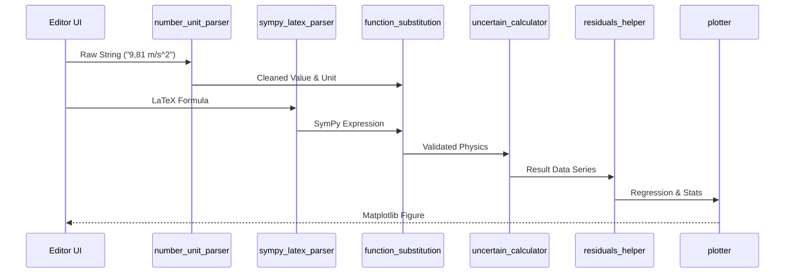

# Polaris-Calc Math Utilities: Comprehensive Technical Manual

This document provides an exhaustive reference for the `utils/math utils/` package. These modules form a state-of-the-art computational engine designed for scientific rigor, international flexibility, and experimental data analysis.

---

## 📋 Table of Contents
1. [Intelligent Data Ingestion](#1-intelligent-data-ingestion)
2. [Physics & Symbolic Computation](#2-physics--symbolic-computation)
3. [Statistical Visualization & Regression](#3-statistical-visualization--regression)
4. [Universal Unit Engine](#4-universal-unit-engine)
5. [Architecture & Interaction Flow](#5-architecture--interaction-flow)
6. [API Reference & Usage](#6-api-reference--usage)
7. [Troubleshooting](#7-troubleshooting)

---

## 1. Intelligent Data Ingestion

### `number_unit_parser.py`: The "Human-to-Machine" Bridge
The parser doesn't just "split" text; it performs a multi-pass analysis to understand intent.

#### Locale Detection Heuristics
- **Rule A (Ambiguity Resolution):** If a single separator is present and followed by exactly 3 digits (e.g., `1.234`), it is assumed to be a thousands separator. If followed by any other number of digits (e.g., `1.23`), it is a decimal point.
- **Rule B (Scientific Context):** If an exponent is present (e.g., `1.5e3`), the parser prioritizes the character before the `e` as a decimal point.

---

## 2. Physics & Symbolic Computation

### `function_substitution.py`: Dimensional Rigor
Implements a full **Dimensional Analysis** engine.
- **Dimensional Tracking:** Every intermediate result carries its 7-tuple SI dimension.
- **Validation:** Raises `ValueError` for physically impossible operations (e.g., `L + T`).

### `uncertain_calculator.py`: Statistical Propagation
Implements the GUM (Guide to the Expression of Uncertainty in Measurement) methodology.
- **Covariance-Aware Propagation:** When $n > 4$, the engine calculates the **sample covariance matrix** between all pairs of input variables.
- **Symbolic Derivatives:** Uses SymPy to compute $\frac{\partial f}{\partial x_i}$ exactly.

---

## 3. Statistical Visualization & Regression

### `plotter.py`: High-Level Matplotlib Wrapper
A dataclass-driven plotting engine that separates "what to plot" from "how to plot it".
- **Supported Plot Types:** `line`, `scatter`, `heatmap`, `contour`, `violin`, `boxplot`, `errorbar`, etc.

### `residuals_helper.py`: The Analyst's Toolkit
- **Regressions:** Linear and Polynomial with full statistics ($R^2$, Pearson $r$, standard errors).
- **Diagnostics:** Shapiro-Wilk (normality) and Durbin-Watson (autocorrelation).

---

## 4. Universal Unit Engine

### `unit_conversor`: N-Dimensional Vector Space
Units are points in a 7-dimensional vector space: `[L, M, T, I, Θ, N, J]`.
- **Compound Logic:** Correctly simplifies units like `kg·m/s²`.
- **Disambiguation:** Handles collisions like `F` (Farad) vs. `F` (Fahrenheit).

---

## 5. Architecture & Interaction Flow


---

## 6. API Reference & Usage

### `number_unit_parser.py`
| Function | Parameters | Returns |
| :--- | :--- | :--- |
| `parse(text)` | `text: str` | `ParsedValue(value, unit, raw)` |
| `evaluate(text)` | `text: str` | `ParsedValue` with evaluated arithmetic. |

**Example:**
```python
from number_unit_parser import evaluate
val = evaluate("(10 + 5) * 2 km") # value=30.0, unit="km"
```

### `sympy_latex_parser.py`
| Function | Parameters | Returns |
| :--- | :--- | :--- |
| `parse_latex(latex_str)` | `latex_str: str` | `sympy.Expr` |

### `number_formatter.py`
| Function | Parameters | Returns |
| :--- | :--- | :--- |
| `smart_format(num, max_chars, latex)` | `num: float`, `max_chars: int`, `latex: bool` | `str` (Scientific or Standard) |

### `function_substitution.py`
| Function | Parameters | Returns |
| :--- | :--- | :--- |
| `evaluate(expr, vars, target_unit, mode)` | `expr: str`, `vars: dict`, `target_unit: str`, `mode: str` | `(value: float, unit: str)` |

**Example:**
```python
vars = {"v": (10, "m/s"), "t": (5, "s")}
res = evaluate("v * t", vars, target_unit="km") # (0.05, "km")
```

### `uncertain_calculator.py`
| Function | Parameters | Returns |
| :--- | :--- | :--- |
| `compute_formula_error_from_series(...)` | `formula, variables, series, sigma_data, units...` | `dict` with full stats, partials, and final $\sigma_f$. |

**Example:**
```python
# 'series' is a dict of lists, 'sigma_data' is a dict of (val, unit)
result = compute_formula_error_from_series("x*y", ["x", "y"], series, sigma_data, units)
print(result['sigma_f_value'])
```

### `plotter.py`
| Function | Parameters | Returns |
| :--- | :--- | :--- |
| `plot(cfg)` | `cfg: FigureConfig` | `matplotlib.figure.Figure` |
| `quick_line(x, y, ...)` | `x, y, title, xlabel, ylabel...` | `matplotlib.figure.Figure` |

**Example:**
```python
from plotter import quick_line
fig = quick_line([1, 2], [10, 20], title="Test", xlabel="X", ylabel="Y")
```

### `residuals_helper.py`
| Function | Parameters | Returns |
| :--- | :--- | :--- |
| `linear_regression(x, y)` | `x, y: Sequence` | `LinearRegressionResult` |
| `residual_diagnostics(res, y_true)` | `res: array`, `y_true: array` | `ResidualDiagnostics` |

### `derivatives.py`
| Function | Parameters | Returns |
| :--- | :--- | :--- |
| `compute_derivative(latex, var)` | `latex: str`, `var: str` | `str` (LaTeX derivative) |

### `unit_conversor.py`
| Function | Parameters | Returns |
| :--- | :--- | :--- |
| `convert(val, from, to)` | `val: float`, `from: str`, `to: str` | `float` (converted value) |
| `get_unit_type(unit)` | `unit: str` | `str` (Physical category) |

---

## 7. Troubleshooting

| Error | Cause | Solution |
| :--- | :--- | :--- |
| `Dimensional mismatch` | Adding quantities with different dimensions. | Check the physical consistency of your formula. |
| `Missing covariance` | 'Many Measures' mode without full data series. | Ensure all variables have same number of points. |
| `Currency inside compound` | Using `$` or `€` in units like `$/m`. | Currency is only allowed as a simple unit. |
